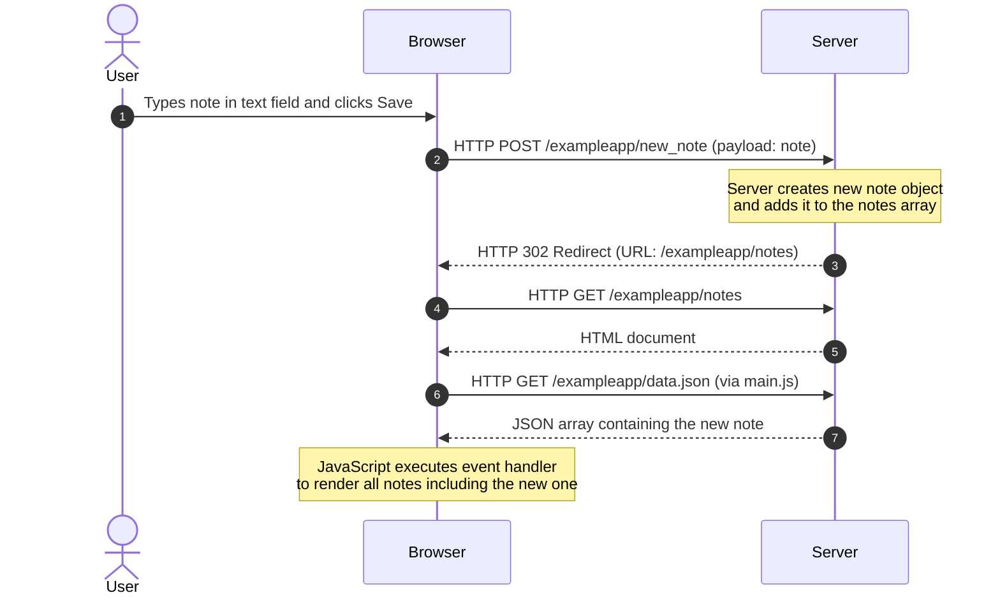

```mermaid
sequenceDiagram
    autonumber
    actor User
    participant Browser
    participant Server

    User->>Browser: Types note in text field and clicks Save
    Browser->>Server: HTTP POST /exampleapp/new_note (payload: note)
    Note over Server: Server creates new note object<br/>and adds it to the notes array
    Server-->>Browser: HTTP 302 Redirect (URL: /exampleapp/notes)
    Browser->>Server: HTTP GET /exampleapp/notes
    Server-->>Browser: HTML document
    Browser->>Server: HTTP GET /exampleapp/data.json (via main.js)
    Server-->>Browser: JSON array containing the new note
    Note over Browser: JavaScript executes event handler<br/>to render all notes including the new one
```
