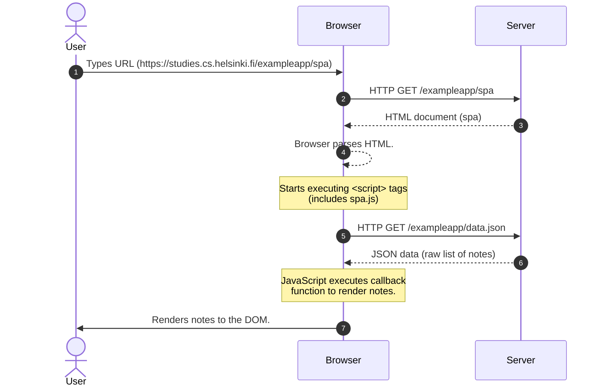

```mermaid
sequenceDiagram
autonumber
actor User
participant Browser
participant Server

    User->>Browser: Types URL (https://studies.cs.helsinki.fi/exampleapp/spa)
    Browser->>Server: HTTP GET /exampleapp/spa
    Server-->>Browser: HTML document (spa)
    Browser-->>Browser: Browser parses HTML.
    Note over Browser: Starts executing <script> tags<br/>(includes spa.js)

    Browser->>Server: HTTP GET /exampleapp/data.json
    Server-->>Browser: JSON data (raw list of notes)
    Note over Browser: JavaScript executes callback<br/>function to render notes.
    Browser->>User: Renders notes to the DOM.
```
